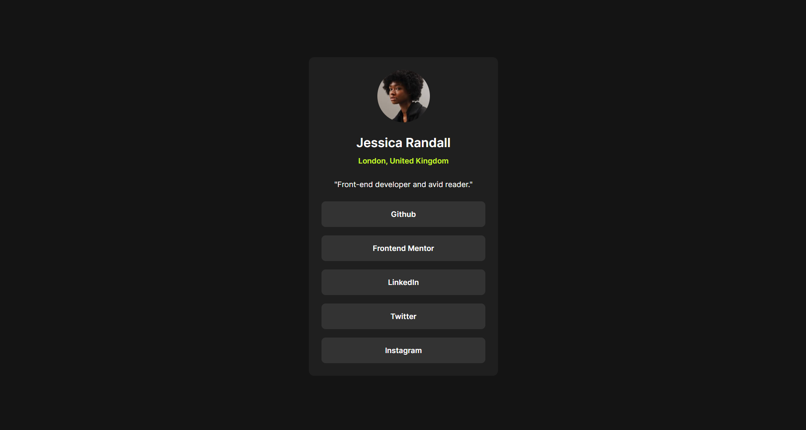

# Frontend Mentor - Social links

This is a solution to the [Social links profile challenge on Frontend Mentor](https://www.frontendmentor.io/challenges/social-links-profile-UG32l9m6dQ)

## Table of contents

- [Overview](#overview)
  - [The challenge](#the-challenge)
  - [Screenshot](#screenshot)
  - [Built with](#built-with)
  - [What I learned](#what-i-learned)
  - [Useful resources](#useful-resources)

## Overview

### The challenge

Users should be able to:

- See hover and focus states for all interactive elements on the page

### Screenshot

### Built with

- Semantic HTML5
- CSS classes
- Mobile-first workflow
- [React](https://reactjs.org/) - JS library
- [Vite](https://vitejs.dev/) - Frontend tool for building web applications

### What I learned

- How to import fonts in React
- How to use nav tags

### Useful resources

- [How to add custom font file to your React App](https://dev.to/ziqinyeow/how-to-add-custom-font-file-to-your-react-app-31kb) - This helped me to understand step by step how to import fonts in my React Project

##### Author: [Angel Añez](https://angel-anez.vercel.app)
